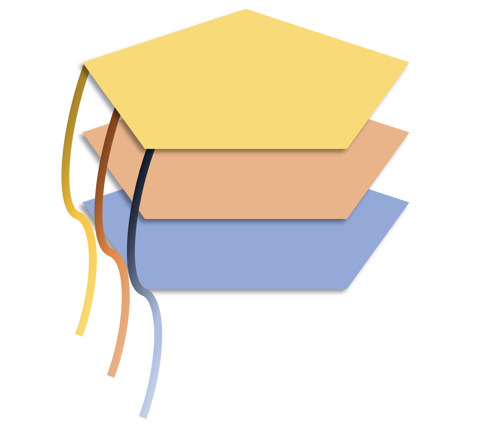
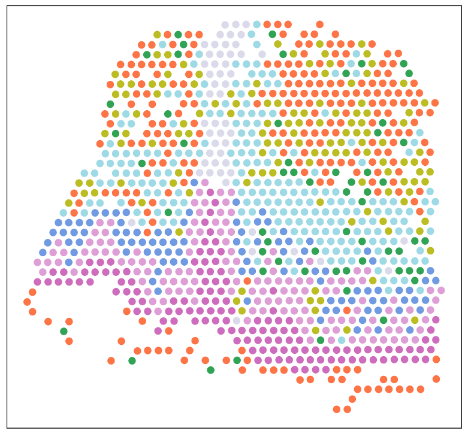
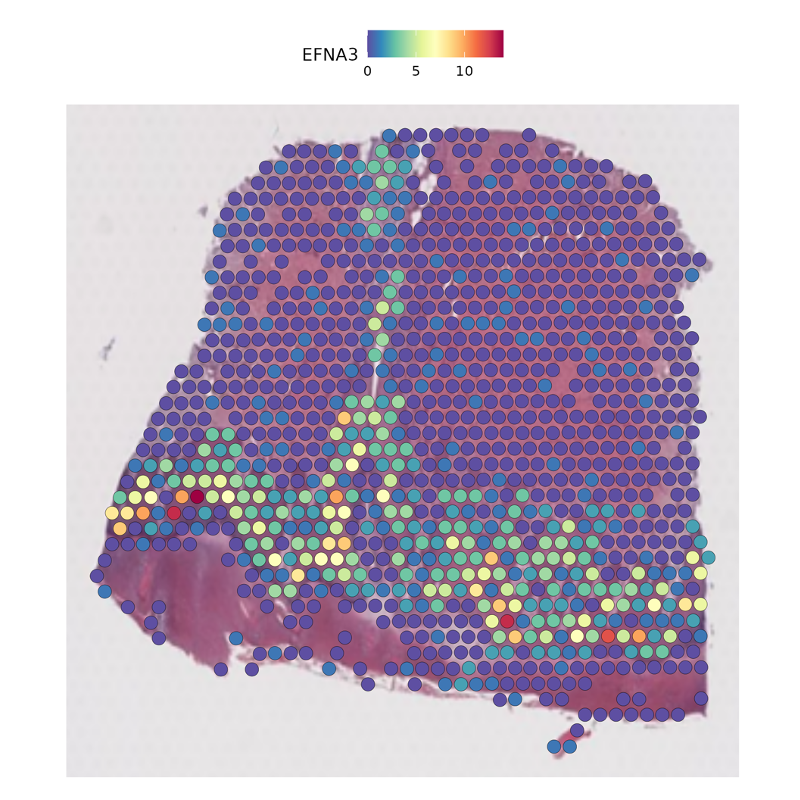
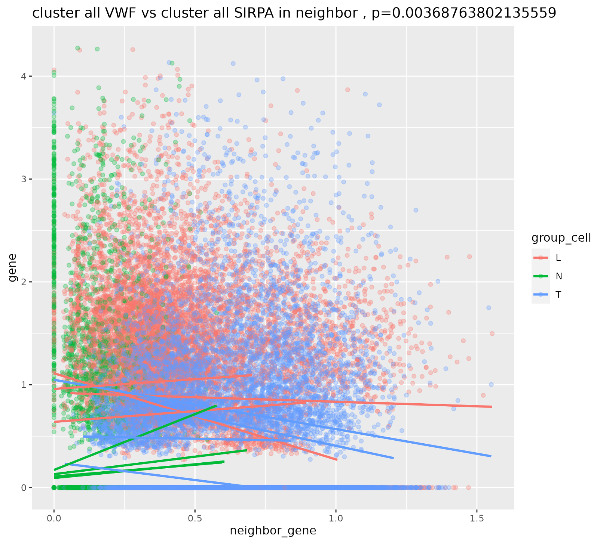

# MultiSpa 
Multisample analysis for spatial transcriptomic (ST) data. 

## Overview
The package involves multisample spatial transcriptomic integration. Together with bunch of steps identifying differentially expressed features among the groups. These features focus on the 

## Read files
Specify the read and save path, together with the files user want to read. 
```{r}
read_path = "./Spatial_visium/Liver/data/"
save_path = "./Spatial_visium/Liver/"
files = list.files(read_path)
```

## Create object list
Create_obj_list creates an object list for PRECAST to integrate. Magic imputation is optional here controled by impute.
```{r}
impute = T
obj_list = create_obj_list(read_path, files, impute = impute)
```

This chunk create seurat object in the following format:
assays 'count', 'PRE_CAST'; 
reductions 'PRECAST', 'position', 'umap', 'pca', 'harmony'(optional); 
clusters 'cluster', 'seurat_clusters'(optional).
```{r}
seuInt = PRECAST_pipeline(obj_list, k = 8, premin.spots = 0, premin.features = 0,
                          postmin.spots = 0, postmin.features = 0)
seuInt = Create_sample(seuInt, files)
saveRDS(seuInt, paste0(save_path, 'seuInt', ifelse(impute, '_impute', ''), '.rds'))
```
<p float="center">
  
  
</p>


## Identify markers of interest
The the user can identify the potential genes to work with. Here we study the markers as an union of all the potential ligand-receptor pairs among the shared highly-variable genes between the non-imputed integrated object and imputed integrated object. The pairs are identified by the R package NICHE. Otherwise user can specify the markers by them self. Note that the running time and space usage increase linearly with the number of markers.
```{r}
seuInt = readRDS(paste0(save_path,'seuInt.rds'))
seuInt_imput = readRDS(paste0(save_path,'seuInt_impute.rds'))

variable_genes = intersect(rownames(seuInt_imput), rownames(seuInt))
pairs = lr_load("fantom5",NULL,'human',variable_genes)
markers = unlist(lr_load("fantom5",NULL,'human',variable_genes))
names(markers) = NULL
markers = unique(markers)
saveRDS(list(markers = markers, pairs = pairs), paste0(save_path, 'markers_shared.rds'))
```

## Generate pseudobulk expression matrix
Generate the pseudobulk expression matrix for the gene expressions in each sample. Bulks are segmented by the default 'ident' in the seurat object, i.e. cluster label.
```{r}
pseudobulk = pseudobulk_gen(seuInt, markers)
```

## Generate neighboring expression matrix
Use the 'Gene_mat_generate' function to generate and save teh neighboring expression matrix. Each row of the matrix is the average expressions of the markers in the k-nearest neighborhood. 'Name' indicates the filename you want to use for saving the matrix. In addition, a length-$k$ list will be saved in 'name_list.rds', where $k$ is the number of clusters created by PRECAST. Each element in the list is the average expressions of the markers within a certain cluster.
```{r}
Gene_mat_generate(seuInt, markers, k=20,
                  save.path = save_path, name = "neighbor_gene_NICHES_k20_shared")
Gene_mat_generate(seuInt_imput, markers, k=20,
                  save.path = save_path, name = "neighbor_gene_imput_NICHES_k20_shared")
```

## Generate neighboring cell proportion matrix
Use the 'Gene_mat_generate' function to generate and save the neighboring cell proportion matrix. Each row of the matrix is the proportions of cells from different clusters. Name' indicates the filename you want to use for saving the matrix.
```{r}
prop_df = neighbor_mat_gen(seuInt, k = 20, save.path = save_path,
                           name = paste0('neighbor_cluster_k20'))$prop_df
```

## Generate local gene interaction matrix
For each cell, find the nearest $k$ paired cells and calculate the interaction between gene1 in the cell and gene2 in the paired cells.
```{r}
Pair_mat_generate(seuInt, markers, k = 1, save.path = save_path, name = 'pair_k1')
```

## Load data for feature selection
Load all the data needed for feature selection, including gene expression, neighboring gene expression, and neighboring cell proportion.
```{r}
impute = F
seuInt = readRDS(paste0(save_path,'seuInt', '.rds'))
neighbor_mat = readRDS(paste0(save_path,'neighbor_gene', '_NICHES_k20_shared.rds'))
neighbor_mat_list = readRDS(paste0(save_path,'neighbor_gene', '_NICHES_k20_shared_list.rds'))
markers = readRDS(paste0(save_path, 'markers_shared.rds'))$markers
pairs = readRDS(paste0(save_path, 'markers_shared.rds'))$pairs
expr_mat = t(GetAssayData(seuInt, slot = "data", assay = 'count')[markers, ])
prop_df = readRDS(paste0(save_path, 'neighbor_cluster_k20', '.rds'))
n_cluster = length(unique(prop_df$cluster))
```

## Add metadata with grouped information
Compose sampletable including the sample-level metadata. The table should contain a column 'sample' for the sample names, a column 'batch' for the batch id, along with any information might be needed for grouped analysis. All the metadata should be added to the seurat object by left_join.
```{r}
sampletable = data.frame(batch = 1:length(files), sample = files)
sampletable$label = rep(c('L', "N", "T"), 4)
sampletable$label_num = rep(c(1, 0, 2), 4)
sampletable$batch = rep(1:4, each = 3)
seuInt$label = left_join(data.frame(sample = seuInt$sample), sampletable, by = 'sample')$label
seuInt$label_num = left_join(data.frame(sample = seuInt$sample), sampletable, by = 'sample')$label_num
seuInt$batch = left_join(data.frame(sample = seuInt$sample), sampletable, by = 'sample')$batch
```

## Top features selection
For feature selection, gene expression, neighboring gene expression, neighboring cell proportion should all be input in order to go through features that potentially have the power to distinguish groups. Statistical tests are conducted on the following features:
gene expression vs neighboring gene expression (restricted in a specific cell cluster),\\ 
gene expression vs neighboring cell celuster proportion.\\ 
If type is set to be 'grouped', then one is testing the features' differences between two groups and t-test is used for this purpose. For example, the first chunk is comparing between tumor slices and normal slices. The name of label, together with the labels within each group should be specified.\\
If type is set to be 'continuous', then one is testing the features' changes along a continuous covariate, and deviance test is used for this purpose. For example, the second chunk is testing against the distance to the tumor. The name of label should be specified, and the label must be numeric.
```{r}
p_top = Feature_selection(neighbor_mat, neighbor_mat_list, prop_df, markers = colnames(neighbor_mat),
                          type = 'grouped', zero_rm = F,
                          seuInt = seuInt, expr_mat = expr_mat,
                          sampletable = sampletable,
                          group = 'sample'
                          group1 = c('HCC-1N', 'HCC-2N', 'HCC-3N', 'HCC-4N'),
                          group2 = c('HCC-1T', 'HCC-2T', 'HCC-3T', 'HCC-4T'))
p_top = arrange(p_top, p.adj)
head(p_top)
saveRDS(p_top, paste0(save_path, 'p_top_raw', '_k20_shared.rds'))
```

```{r}
p_top = Feature_selection(neighbor_mat, neighbor_mat_list, prop_df, markers = colnames(neighbor_mat),
                          type = 'continuous', zero_rm = F,
                          seuInt = seuInt, expr_mat = expr_mat,
                          sampletable = sampletable,
                          group = 'label_num')
p_top = arrange(p_top, p.adj)
head(p_top)
saveRDS(p_top, paste0(save_path, 'p_time_raw', '_zerokept_k20_shared.rds'))
```

## Top features plots
The package provides visualization for the features' differential expression. For example, here we are plotting the co-expression of the top 10 gene pairs detected by the package.
```{r}
p_top = readRDS(paste0(save_path, 'p_time_raw', '_k20_shared.rds'))
if(nrow(p_top) > 0){
  for(j in 1:10){
    plot_gene_by_gene(p_top$gene[j], p_top$neighbor_gene[j], 
                      p_top$cluster[j], p_top$neighbor_cluster[j], p_adj = p_top$p[j],
                      expr_mat, neighbor_mat, neighbor_mat_list,
                      cell_by = seuInt$label, smooth_by = seuInt$label, facet_by = seuInt$batch, zero_rm = F)
  }
}
```
<p float="center">
  
</p>
